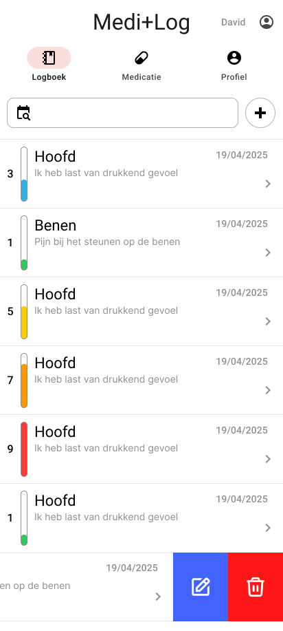
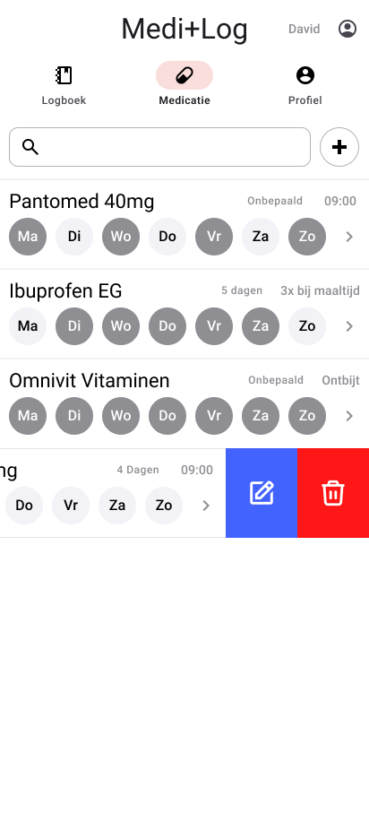

# Permanente evaluatie

**Vul hieronder verder aan zoals beschreven in de [projectopgave](https://javascript.pit-graduaten.be/evaluatie/mobile/pe.html).**

## Scherm 1
### Logboek overzicht
_Screenshot en beschrijving van de functionaliteiten in het eerste scherm van je app._\
\

In het logboek scherm kan je een overzicht zien van alle toegevoegde logs/klachten van de ingelogde user. Een nieuwe log kan aangemaakt worden met de plus knop. Het veld naast de plus knop dient om te filteren op een bepaalde datum.
Enkele gegevens van de log worden al in het overzicht weergegeven.
* Datum van log/klacht
* Lichaamsdeel waar men last heeft
* De klacht zelf (tot aantal bepaald karakters)
* Het niveau van hoe ernstig de pijn/klacht is weergegeven met een cijfer en kleur code

Als men swiped op een item kan men kiezen om het te bewerken of te verwijderen.

De gegevens worden opgehaald en wegeschreven naar de databank. Dit geld voor alle schermen. De applicatie zal enkel online werken.

#### Extra
Indien er tijd over is kan ik nog een filter knop toevoegen voor het filteren op lichaamsdelen

## Scherm 2
### Medicatie overzicht
_Screenshot en beschrijving van de functionaliteiten in het tweede scherm van je app._\
\
Op dit Scherm Kan je zien welke medicatie je moet nemen. Er staat aangeduid welke dagen je de medicatie moet nemen en wanneer en hoelang. je kan hier filteren op de namen van de medicatie. Ook het toevoegen is op dezelfde manier. Door het swipen kan je net zoals bij het logboek een item aanpassen of verwijderen.

## Scherm 3
### Log detail pagina (CRUD operations)
_Beschrijving van de functionaliteiten in het derde scherm van je app._

Deze pagina krijg je te zien als je een logboek item toevoegd bekijkt of wilt aanpassen.

#### Edit of toevoegen
Je moet volgende items invullen:
* Datum en tijd van klacht m.b.v. datetime picker module
* Lichaamsdeel waar de klacht zich voordoet
* Beschrijving van de klacht
* Een cijfer om het niveau van de pijn/ernstigheid in kaart te brengen (schaal 1/10)
* Eventuele opmerkingen: Hier kan je bijvoorbeeld invullen dat je de klacht hebt gekregen na het eten van iets. Of eender welke randinformatie je nog wenst bij te houden bij de klacht.

Alle onderdelen zijn verplicht behalve de opmerkingen.
Deze opmerkingen kan je dan opslaan met behulp van een opslaan knop.

#### Bekijken
Als je vanuit het logboek op een item klikt krijg je extra informatie te zien. Deze informatie is hierboven al vermeld. Bovenaan zullen twee knoppen staan een om de gegevens aan te passen en een andere om de log te verwijderen.

## Scherm 4
### Medicatie details (CRUD operations + instellen notifications/timers)
_Beschrijving van de functionaliteiten in het vierde scherm van je app._

Dit scherm doet hetzelfde als het scherm voor de log info en is op een gelijkaardige manier opgebouwd.
Bij een medactie moeten de volgende item invullen:
* Titel van medicijn item: Dit is zelf te kiezen door de persoon en dient enkel om op te filteren en weer te geven in het overzicht
* Medicijn: Dit is een dropdown veld. Hier moet men kiezen uit een lijst van medicijnen die worden opgehaald m.b.v. API Call.
* Duratie: Hier moet je invullen hoeveel dagen je het medicijn moet innemen
* Moment van inname: Hier moet men invullen wanneer men het medicijn moeten innemen (dagen en momenten) Deze reminders worden m.b.v. de kalender aangemaakt
* Aandachtspunten: Dit wordt automatisch ingevuld door de opgehaalde informatie van de API call
* Foto van medicijn: Je kan als je wilt een foto nemen van het verkregen doosje en/of pil en deze wordt mee bijgehouden.

De Title van het medicijn, de duratie en het moment van inname zijn verplicht.

Aan de hand van wat er hiet wordt ingesteld zal je gsm automatisch je reminder notificaties sturen voor het nemen van je medicatie.

## Scherm 5
### Login Scherm (User based app)
_Beschrijving van de functionaliteiten in het vijfde scherm van je app._

Als deze pagina opstart wordt er eerst gekeken of er verbinding is met het internet.

Als je niet bent ingelogd of als je de Applicatie opstart moet je inloggen. Aan de hand van deze login gegevens worden alle andere getoonde informatie bepaald. Hier krijg je feedback als je correct bent ingelogd met een animatie voordat de applicatie naar zijn logboek pagina gaat (Homescherm)

Je zal kunnen inloggen met email en passwoord of met faceId of fingerprint.

## Scherm 6
### Profiel
_Beschrijving van de functionaliteiten in het zesde scherm van je app._

Als je op het profiel tabje klikt krijg je een simpele pagina te zien waar jou gegevens staan opgelijst.
* Voornaam
* Achternaam
* email
* Adres

Hier kan je jou gegevens aanpassen.

Ook kan je hier kiezen om het inloggen met vinger of gezicht te deactiveren of activeren.

Je kan hier ook uitloggen om terug op de login-pagina te komen

## Native modules
_Bespreek hier minstens twee native modules die je verwerkt in je applicatie.
Lees de [projectopgave](https://javascript.pit-graduaten.be/evaluatie/mobile/project.html#native-modules) voor meer info 
over wat een native module juist is._

### expo-camera
Link: https://docs.expo.dev/versions/latest/sdk/camera/\
Deze zal gebruikt worden om een foto te kunnen maken van je medicatie

### expo-calender
Link: https://github.com/expo/expo/tree/main/packages/expo-calendar\
Deze module zal gebruikt worden om met de calender van het toestel te communiceren. Dit zal gebruikt worden om te reminders in te stellen voor het nemen van de pillen

### DateTimePicker
Link: https://github.com/react-native-datetimepicker/datetimepicker\
Deze module communiceert met de system OS om de correcte datetimepicker te laten zien. Dit zal gebruikt worden om bij het loggen de juiste date time in te vullen

### react-native-swipeable-list
Link: https://github.com/esthor/react-native-swipeable-list\
Deze module zorgt ervoor dat op de list items geswiped kan worden voor het kiezen van verschillende opties (deleten/edit).

### expo-local-authentication
Link: https://github.com/expo/expo/tree/main/packages/expo-local-authentication\
Deze module zal gebruikt kunnen worden om in te kunnen loggen met faceID of fingerprint.

## Online services
_Bespreek hier minstens één online service die je verwerkt in je applicatie.
Lees de [projectopgave](https://javascript.pit-graduaten.be/evaluatie/mobile/project.html#online-services) voor meer info
over wat een native module juist is._

### Supabase / Supabase Auth / Supabase Storage
Ik zal Supabase gebruiken om alle gegevens die gelogd worden op te slaan in een database, de Auth zal ik gebruiken om user based te kunnen inloggen en dus als gevolg dat elke user enkel zijn eigen opgelage logs kan bekijken. De Storage zal ik gebruiken om de fotos die genomen zijn in de applicatie op te slaan. Dit zijn fotos die enkel relevant zijn voor de gebruiker die is ingelogd als hij met de toepassing bezig is dus zie het nut niet in om deze ook in de media galerie op te slaan van het toestel zelf.

### Rest API Drugbank
Link API Documention: https://docs.drugbank.com/v1/#selecting-your-region\
Ik zou graag bij de meciatie de optie hebben om de medicatie te selecteren dat je ook extra informatie over die bepaalde pillen kan zien.1

## Gestures & animaties
_Bespreek hier waar je minstens één gesture en één animatie verwerkt in je applicatie._

### Swipen op een item.
Als je een log swiped krijg je verschillende opties te zien wat je wilt doen met de log. (Delete/Edit)

### Animation on login
Nadat je succesvol bent ingelogd zal er een kleine animatie afspelen voor dat de app naar zijn andere paginas gaat.

### Edit log
Als je een log item swiped is dit geanimeerd.

# Feedback

**Wordt verder aangevuld door jouw docent.**

